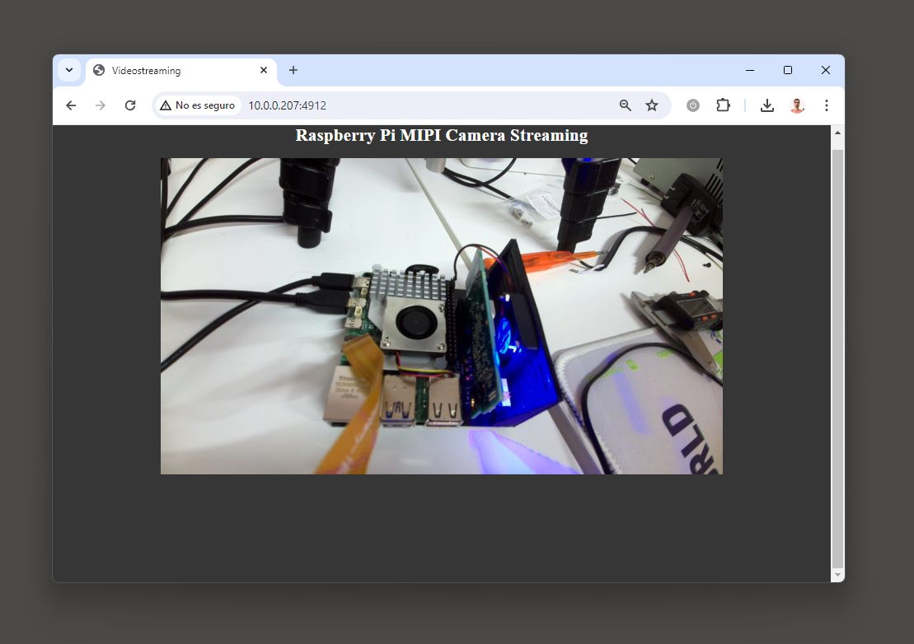
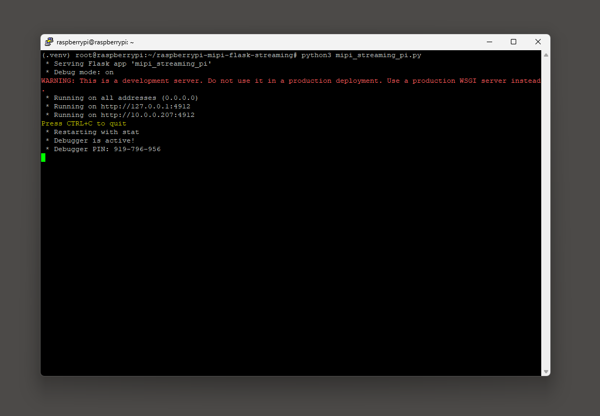

# Raspberry Pi MIPI Flask Streaming

First ever Raspberry Pi example of how to stream live video from a MIPI camera using Flask



## Environment Setup

Create a virtual environment:
```
python3 -m venv .venv --system-site-packages # create virtual env
source .venv/bin/activate  # enter virtual env
```

Install `git` and update the system:
```
apt-get update
apt-get install -y git
```
Clone this repository:
```
git clone https://github.com/mcmchris/raspberrypi-mipi-flask-streaming.git
cd raspberrypi-mipi-flask-streaming # enter the repo directory
```

Install dependencies manually:
```
apt-get install python3-pip -y
python3 -m pip install opencv-python
python3 -m pip install Flask
sudo apt install -y python3-picamera2 # install picamera2 library
```
For more details about the `picamera2` library, see its [documentation](https://datasheets.raspberrypi.com/camera/picamera2-manual.pdf)

Run the Python example and start live streaming:
```
python3 mipi_streaming_pi.py
```

Enter the shown IP and port on your favorite web  browser to start the streaming:



